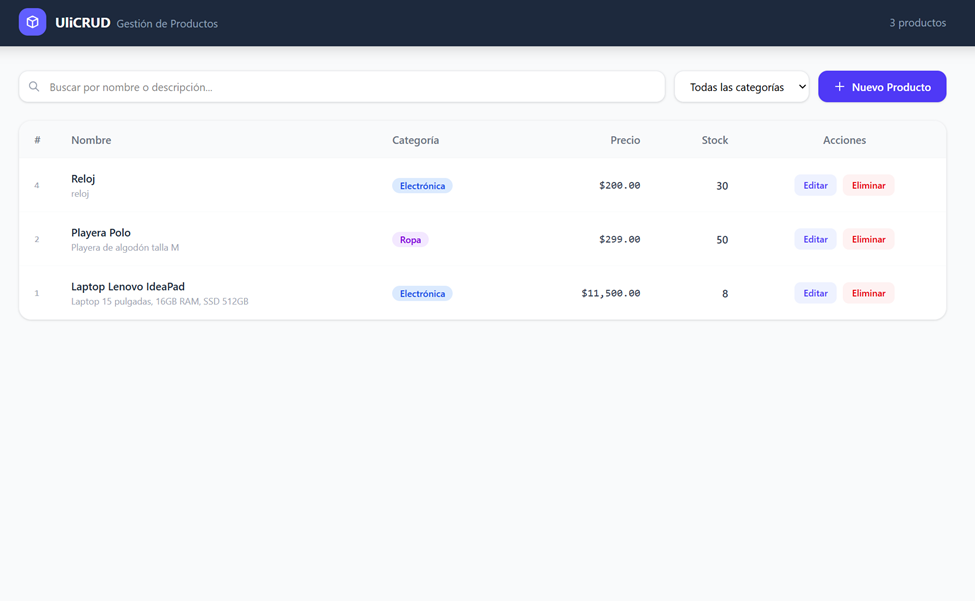
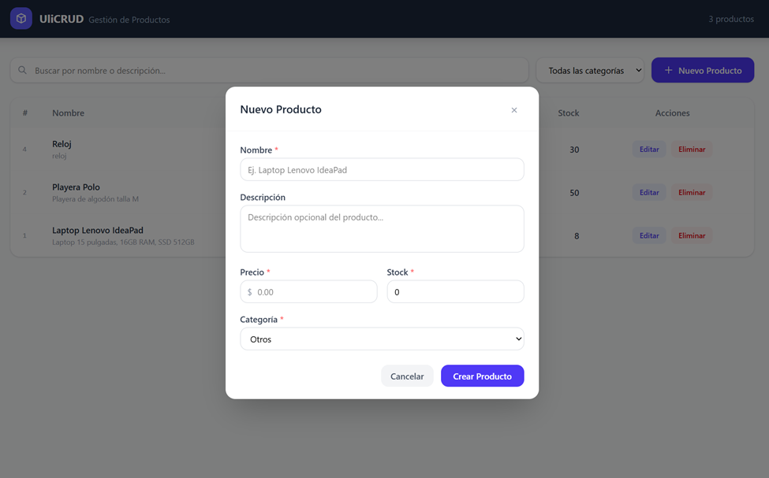
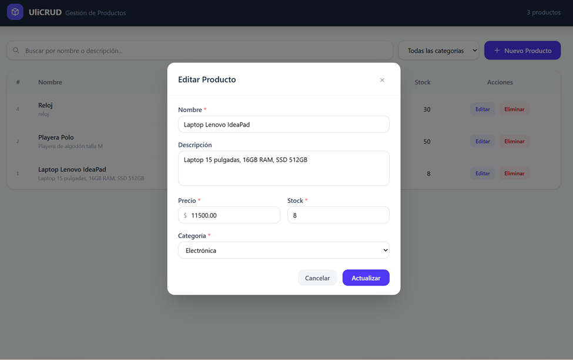
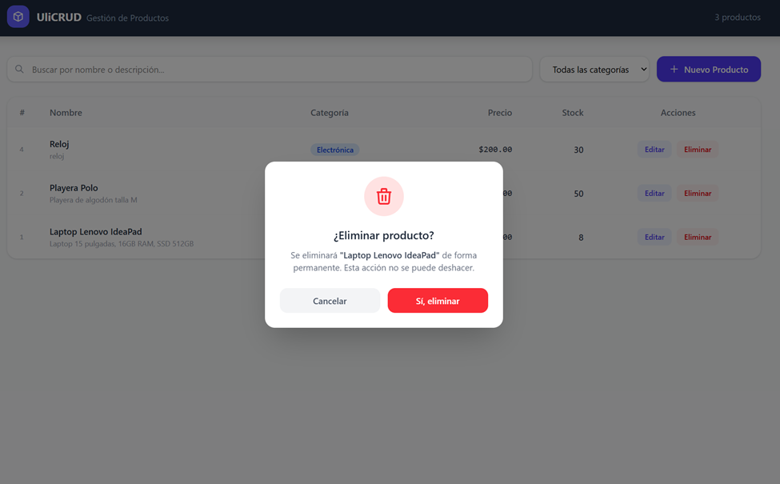

<div align="center">

# UliCRUD

### Sistema de Gestión de Productos


**Aplicación full-stack para la gestión de productos con operaciones CRUD completas.**  
Backend construido con Django REST Framework · Frontend moderno con React + Vite + Tailwind CSS

</div>

---

## Descripción

**UliCRUD** es una aplicación web full-stack de gestión de inventario de productos. Permite crear, consultar, editar y eliminar productos a través de una interfaz moderna y responsiva conectada a una API REST.

El proyecto sigue una arquitectura desacoplada: el backend expone una API RESTful en Django y el frontend en React consume esa API de forma independiente.

---

## Tecnologias utilizadas

| Capa | Tecnología | Versión |
|------|-----------|---------|
| **Backend** | Python | 3.10+ |
| | Django | 6.0.5 |
| | Django REST Framework | 3.17.1 |
| | PyMySQL | 1.1.3 |
| | django-cors-headers | 4.9.0 |
| **Frontend** | React | 18.3.1 |
| | Vite | 6.0.5 |
| | Tailwind CSS | 4.0.0 |
| **Base de datos** | MySQL | 8.0+ |

---

## Funcionalidades

- **Listado de productos** — Tabla paginada (10 por página) con todos los productos registrados
- **Busqueda en tiempo real** — Filtra por nombre o descripción del producto
- **Filtro por categoria** — Electronica, Ropa, Alimentos, Hogar, Deportes, Otros
- **Crear producto** — Formulario modal con validacion de campos
- **Editar producto** — Formulario modal pre-cargado con los datos actuales
- **Eliminar producto** — Modal de confirmacion antes de eliminar
- **Indicadores de stock** — Etiquetas visuales: `agotado` (rojo) y `bajo` (amarillo) segun cantidad
- **Notificaciones toast** — Mensajes de exito y error con auto-cierre
- **Panel de administracion** — Django Admin disponible en `/admin`
- **API REST documentada** — Endpoints accesibles via navegador o cliente HTTP

---

## Capturas de pantalla


| Vista | Descripcion |
|-------|-------------|
|  | Tabla principal con busqueda, filtros y paginacion |
|  | Modal para registrar un nuevo producto |
|  | Modal de edicion pre-cargado |
|  | Confirmacion antes de eliminar |


---

## Estructura del proyecto

```
ulicrud/
├── ulicrud/                # Configuracion del proyecto Django
│   ├── settings.py         # Configuracion global (BD, CORS, DRF)
│   └── urls.py             # Enrutador principal
├── productos/              # Aplicacion Django (logica de negocio)
│   ├── models.py           # Modelo Producto
│   ├── serializers.py      # Serializers DRF
│   ├── views.py            # ProductoViewSet (endpoints REST)
│   ├── urls.py             # Rutas de la API
│   └── admin.py            # Configuracion del admin
├── frontend/               # Aplicacion React
│   └── src/
│       ├── api/
│       │   └── productos.js    # Cliente de la API REST
│       ├── components/
│       │   ├── ProductoForm.jsx    # Formulario crear/editar
│       │   └── ConfirmModal.jsx    # Modal de confirmacion
│       └── App.jsx              # Componente principal
├── requirements.txt        # Dependencias Python
├── manage.py               # CLI de Django
└── README.md
```

---

## Instrucciones para ejecutar el proyecto

### Requisitos previos

- Python 3.10 o superior
- Node.js 18 o superior
- MySQL 8.0+ corriendo en `localhost:3306`

---

### 1. Clonar el repositorio

```bash
git clone https://github.com/Christian20233tn137/ulicrud.git
cd ulicrud
```

---

### 2. Configurar la base de datos MySQL

Abre tu cliente MySQL (Workbench, consola, etc.) y ejecuta:

```sql
CREATE DATABASE ulicrud CHARACTER SET utf8mb4 COLLATE utf8mb4_unicode_ci;
```

---

### 3. Configurar y ejecutar el Backend

```bash
# Crear y activar entorno virtual
python -m venv .venv

# Windows
.venv\Scripts\activate

# Linux / macOS
source .venv/bin/activate

# Instalar dependencias
pip install -r requirements.txt

# Aplicar migraciones
python manage.py migrate

# (Opcional) Crear superusuario para el panel de administracion
python manage.py createsuperuser

# Iniciar el servidor
python manage.py runserver
```

El backend estara disponible en: **http://localhost:8000**  
Panel de administracion: **http://localhost:8000/admin**

---

### 4. Configurar y ejecutar el Frontend

Abre una **nueva terminal** (mantén el backend corriendo):

```bash
cd frontend
npm install
npm run dev
```

El frontend estara disponible en: **http://localhost:5173**

---

## Endpoints de la API

| Metodo | Endpoint | Descripcion |
|--------|----------|-------------|
| `GET` | `/api/productos/` | Listar productos (paginado) |
| `POST` | `/api/productos/` | Crear nuevo producto |
| `GET` | `/api/productos/{id}/` | Detalle de un producto |
| `PUT` | `/api/productos/{id}/` | Actualizar producto completo |
| `PATCH` | `/api/productos/{id}/` | Actualizar campos parciales |
| `DELETE` | `/api/productos/{id}/` | Eliminar producto |
| `GET` | `/api/productos/categorias/` | Listar categorias disponibles |

**Parametros de consulta disponibles:**

```
GET /api/productos/?search=laptop          # Buscar por nombre o descripcion
GET /api/productos/?categoria=electronica  # Filtrar por categoria
GET /api/productos/?page=2                 # Paginacion
```

---

## Modelo de datos — Producto

| Campo | Tipo | Descripcion |
|-------|------|-------------|
| `id` | Auto | Identificador unico |
| `nombre` | CharField | Nombre del producto (max 200 caracteres) |
| `descripcion` | TextField | Descripcion detallada (opcional) |
| `precio` | DecimalField | Precio en pesos (2 decimales, no negativo) |
| `stock` | PositiveIntegerField | Unidades disponibles (default: 0) |
| `categoria` | CharField | `electronica` `ropa` `alimentos` `hogar` `deportes` `otros` |
| `fecha_registro` | DateTimeField | Fecha de alta (automatica) |
| `fecha_actualizacion` | DateTimeField | Ultima modificacion (automatica) |

---

## Uso de Inteligencia Artificial

Este proyecto fue desarrollado con apoyo de **Claude (Anthropic)** como herramienta de asistencia.

La IA se utilizo para:

- **Generacion de codigo base** — estructura inicial del ViewSet, serializer y configuracion de CORS
- **Depuracion** — identificacion de errores en la configuracion de rutas y en la conexion con MySQL
- **Revision de codigo** — sugerencias de mejora en validaciones del modelo y manejo de errores en el frontend
- **Documentacion** — apoyo en la redaccion de este README

> Todo el codigo fue revisado, entendido y adaptado por el autor. El alumno es capaz de explicar el funcionamiento general de cada modulo del sistema.

---

## Autor

**Christian** — [@Christian20233tn137](https://github.com/Christian20233tn137)

---

<div align="center">

Proyecto academico desarrollado con Django REST Framework y React

</div>
